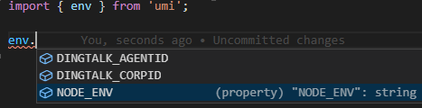

# umi-plugin-env

A plugin for umi@3 which pass `process.env` to browser environment.

## Usage

```bash
# add dependencies to your umi3 project
npm install umi-plugin-env -D
```

## Config

```js
// .umirc.ts or config/config.ts
export default {
  // ...other config
  env: {
    envKeys: ['YOUR_ENV_NAME', 'YOU_WILL_GOT_EMPTY_STRING_IF_VARIABLE_NOT_EXISTS'],
    argvKeys: ['customArgName'],
  },
};
```

```js
// project file xxx.js
import { env, argv } from 'umi';

console.log(env['YOUR_ENV_NAME']);
console.log(argv.customArgName);
```


